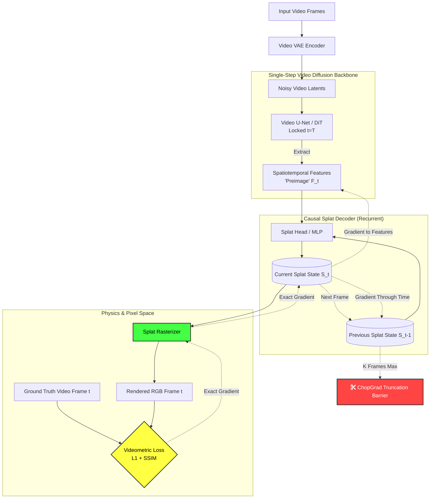

# Architecture Diagram: Dyna World v1 Beta

This diagram illustrates the data flow for training the Dyna World v1 Beta architecture on long-form video. It highlights the single-step diffusion preimage, the Causal Splat Decoder, and the ChopGrad truncation barrier.

### Key Data Paths

1. **Forward Pass (Green/Solid Lines):** 
   - A video chunk is passed through the backbone for *one single step*.
   - The features $F_t$ are fed into the Causal Splat Decoder alongside the previous frame's splat state $S_{t-1}$.
   - The output $S_t$ is rasterized into an image.
   
2. **Backward Pass (Dashed Lines):**
   - The pixel loss flows backward perfectly through the rasterizer into $S_t$.
   - The gradient splits: part of it updates the UNet features $F_t$, and part of it flows back in time to $S_{t-1}$ to update the recurrent weights.
   - **The Red Barrier:** ChopGrad intervenes. After the gradient flows backward through $K$ splat states (e.g., 4 frames), PyTorch `.detach()` is called. The gradient stops. The UNet computation graph for $t-5$ is completely freed from VRAM.