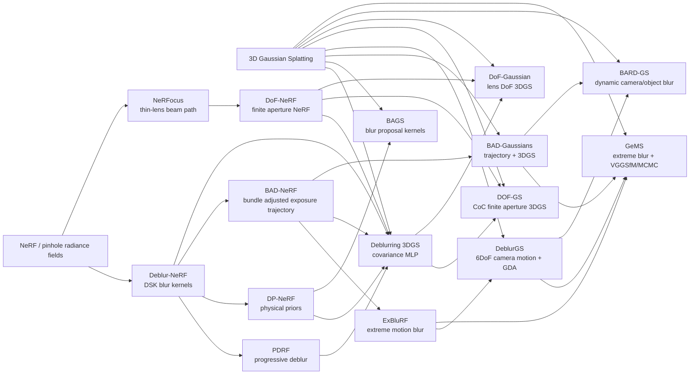

# Blur, Depth Of Field, And Camera Effects In NeRF / 3DGS

Date: 2026-04-24

Question:

Can DynaWorld account for f-stop, focal length, camera blur, motion blur, and
focal / out-of-focus blur by adding them to the renderer pass and inferring
blur-related camera state from camera tokens?

Short answer:

Yes, but the renderer should model blur as capture/render state, not as
permanent scene content. The exported world asset should remain sharp and
time-queryable. Motion blur is integration over exposure time. Defocus blur is
integration over a finite aperture. The camera token can predict the nuisance
parameters, but it must predict the right quantities: projection focal length is
not enough, and physical f-stop is not identifiable from monocular RGB without
sensor / scale calibration.

Local corpus:

The follow-up corpus lives at
`research_notes/blur_dof_motion_papers/paper_index.md`. It currently indexes 55
papers, with downloaded PDFs in `blur_dof_motion_papers/pdfs/` and extracted
text in `blur_dof_motion_papers/text/`. Use
`blur_dof_motion_papers/extraction_notes.md` for formula anchors and the next
extraction pass.

## Working Model

Observed video pixels should be treated as finite camera measurements:

```text
I_obs(x) =
    int_{tau in shutter} int_{a in aperture}
        R(W, C(tau, a), t + tau)(x) p(tau) p(a) da dtau
```

where:

- `W` is the sharp world / splat state.
- `C(tau, a)` is the camera state during exposure and for a sampled aperture
  point.
- `R` is the differentiable splat renderer.
- `tau` handles motion blur.
- `a` handles finite aperture / depth of field.

For implementation, approximate the integral with stratified samples:

```text
I_obs ~= (1 / K_t K_a) sum_i sum_j R(W(t_i), C(t_i, a_j))
```

This makes blur a renderer-pass effect with gradients back to:

- splat geometry / appearance,
- camera trajectory during exposure,
- focus distance,
- aperture / effective circle-of-confusion strength,
- dynamic object trajectories.

## Minimal Camera / Capture State To Store Or Predict

Separate these concepts. Collapsing them into one "focal length" scalar will
make the model ambiguous.

### Pinhole Projection

Required for sharp rendering and for converting physical effects into pixels:

```text
fx, fy, cx, cy
image_width, image_height
crop / resize transform
optional distortion parameters
```

`fx/fy` in pixels are projection intrinsics. They are not the same thing as the
physical lens focal length unless sensor size / pixel pitch is known.

### Defocus / Depth Of Field

Required for focal blur:

```text
focus_distance_z       # depth in camera coordinates, or inverse focus depth
aperture_diameter D    # or f-number N
physical focal length F
effective CoC strength Q
aperture shape         # disk by default; polygon / cat-eye later
```

The physically meaningful first-order circle-of-confusion radius is:

```text
r_coc(z) ~= 0.5 * Q * abs(1 / z - 1 / z_focus)
Q = F * D = F^2 / N
```

This is the simplified model used by DOF-GS, with `Q = F A` and `A` the
aperture parameter / diameter. In a monocular learned renderer, `Q` is usually
more identifiable than `(F, N, sensor_size)` separately.

Recommended learned parameterization:

```text
inv_focus = 1 / z_focus
log_Q_eff = log(effective CoC strength in renderer units)
r_coc_px = 0.5 * exp(log_Q_eff) * abs(inv_z - inv_focus)
```

For user controls, expose f-stop only after calibration:

```text
D = F / N
Q = F^2 / N
```

Without EXIF / sensor calibration / scene metric scale, "f/1.8" is a UI label
mapped to an effective blur strength, not a directly recoverable physical fact.

### Motion Blur / Camera Blur

Required for shutter integration:

```text
t_mid
exposure_duration
shutter_curve          # box at first; learned or metadata later
pose_mid
se3_velocity           # 6D angular + translational velocity
optional se3_accel or Bezier control poses
rolling_shutter_readout_fraction
```

Simple start:

```text
C(tau) = exp(tau * xi_dot) C_mid
tau in [-0.5 * exposure_duration, 0.5 * exposure_duration]
```

More robust trajectory model:

```text
C(tau) = Bezier_SE3(control_poses, tau)
```

This follows BAD-NeRF / BAD-Gaussians / GeMS more closely and avoids assuming a
constant velocity over long exposure.

### Dynamic Object Motion Blur

Camera motion is not enough for DynaWorld videos. Dynamic objects need their
own within-exposure state:

```text
mu_i(t + tau)
rotation_i(t + tau)
scale_i(t + tau)       # usually slower / optional
opacity_i(t + tau)
color_i(t + tau)
```

Fast approximation:

```text
mu_i(t + tau) ~= mu_i(t) + tau * v_i(t)
```

Better DynaWorld fit:

Use the existing time-conditioned splat generator at each sub-shutter sample.
This is slower but keeps the sharp world model honest.

## Renderer Design Choice

There are two families of implementation.

### Exact Sampling

Render multiple virtual cameras / timestamps and average them.

Pros:

- physically faithful,
- easy to verify against synthetic ground truth,
- handles camera motion, object motion, and finite aperture in one path,
- hard for the model to hide blur by merely enlarging splats.

Cons:

- multiplies renderer cost by `K_t * K_a`,
- requires careful sampling to avoid noise,
- needs fast batched rendering to be practical.

### Covariance / Kernel Approximation

Inflate each projected Gaussian's screen-space covariance:

```text
Sigma_eff = Sigma_2d
          + sigma_dof(z)^2 I
          + sigma_time^2 v_screen v_screen^T
```

or convolve rasterized splats with learned / physical kernels.

Pros:

- fast,
- natural for 3DGS because splats already have projected covariances,
- good for preview and coarse training.

Cons:

- easier to cheat by baking blur into geometry,
- cannot cleanly model occlusion changes during camera motion,
- dynamic object blur and camera blur are confounded,
- large defocus kernels need visibility-aware compositing, not just a 2D blur.

Recommendation:

Use exact sampling as the correctness path. Add covariance / kernel
approximations only after synthetic tests prove they match the sampled renderer
within a bounded error.

## Paper Set

This is more than 10 papers because the useful tree splits into defocus,
motion blur, and 3DGS-specific descendants.

| Paper | Year | Representation | Blur type | Core mechanism | Why it matters |
|---|---:|---|---|---|---|
| [Deblur-NeRF](https://arxiv.org/abs/2111.14292) | 2022 | NeRF | motion + defocus | Deformable Sparse Kernel that synthesizes blurry rays during training | Foundational analysis-by-synthesis blur NeRF; shows sharp radiance field can be recovered from blurry inputs. |
| [NeRFocus](https://arxiv.org/abs/2203.05189) | 2022 | NeRF | defocus / DoF | Thin-lens beam-path / frustum rendering | Directly frames focus distance and aperture as render-time controls. |
| [DoF-NeRF](https://arxiv.org/abs/2208.00945) | 2022 | NeRF | defocus / DoF | Explicit aperture simulation, plug-in NeRF extension | Strongest early reference for finite-aperture NeRF and editable focus/aperture controls. |
| [PDRF](https://arxiv.org/abs/2208.08049) | 2022 | NeRF / voxel-assisted | blurry images | Progressive deblurring with 3D scene context and importance sampling | Useful for fast optimization and progressive blur modeling. |
| [DP-NeRF](https://arxiv.org/abs/2211.12046) | 2023 | NeRF | motion + defocus | Rigid blur kernel + adaptive weight proposal using physical priors | Adds 3D consistency and depth/blur-aware weights; important caution against purely 2D kernels. |
| [BAD-NeRF](https://arxiv.org/abs/2211.12853) | 2023 | NeRF | camera motion blur | Jointly optimizes NeRF and camera motion trajectories during exposure | The clean exposure-time camera trajectory template. |
| [ExBluRF](https://arxiv.org/abs/2309.08957) | 2023 | voxel radiance field | extreme camera motion blur | 6-DOF trajectory blur with efficient voxel fields | Shows the cost problem and the value of faster explicit-ish fields. |
| [Deblurring 3D Gaussian Splatting](https://arxiv.org/abs/2401.00834) | 2024 | 3DGS | motion + defocus + object blur | Small MLP manipulates Gaussian covariance to model blurriness | Important 3DGS kernel/covariance approximation baseline; useful but easy to overfit blur into splats. |
| [BAGS](https://arxiv.org/abs/2403.04926) | 2024 | 3DGS | blur-agnostic | Per-pixel blur kernels from Blur Proposal Network, quality mask, coarse-to-fine kernels | Good general-purpose degraded-input baseline; less physically identifiable than lens/shutter params. |
| [BAD-Gaussians](https://arxiv.org/abs/2403.11831) | 2024 | 3DGS | camera motion blur | Bundle-adjusted camera trajectory plus Gaussian optimization | Splat-side successor to BAD-NeRF; close to what a renderer-pass motion blur module should do. |
| [DeblurGS](https://arxiv.org/abs/2404.11358) | 2024 | 3DGS | camera motion blur | Estimates 6-DoF camera motion per blurry observation; densification annealing | Handles noisy SfM poses and smartphone-like blurry captures. |
| [DOF-GS](https://arxiv.org/abs/2405.17351), [project](https://dof-gs.github.io/), [code](https://github.com/rongduo/DOFGS_implementation) | 2025 | 3DGS | defocus / DoF | Finite-aperture camera, differentiable CoC rendering, learnable focus distance and aperture parameter per view | Most directly relevant for focal blur / post-capture refocus in 3DGS. |
| [DoF-Gaussian](https://arxiv.org/abs/2503.00746) | 2025 | 3DGS | defocus / DoF | Lens-based DoF model, depth priors, defocus-to-focus adaptation | Another modern 3DGS DoF implementation; emphasizes controllable lens parameters and refocusing. |
| [BARD-GS](https://arxiv.org/abs/2503.15835) | 2025 | dynamic 3DGS | camera + object motion blur | Decomposes blur into camera-motion and object-motion components | Most relevant for DynaWorld dynamic videos, where objects move during exposure. |
| [GeMS](https://arxiv.org/abs/2508.14682), [HTML](https://arxiv.org/html/2508.14682v1) | 2025 | 3DGS | extreme camera motion blur | VGGSfM initialization from blurred inputs, 3DGS-MCMC, Bezier camera trajectories, event-assisted variant | Latest linked paper; key lesson is robust initialization under severe blur, not just renderer physics. |

## Citation / Influence Tree

This is a topical dependency graph, not an exhaustive citation-count tree.
Semantic Scholar was partially rate limited during the check, so the stable
edges below are mostly from paper reference lists and direct abstract/project
claims. Counts are drift-prone.



Partial live citation snapshot from the
[Semantic Scholar Graph API](https://api.semanticscholar.org/api-docs/graph) on
2026-04-24:

- Deblur-NeRF had about 264 citations.
- BAD-NeRF had about 110 citations.
- DP-NeRF had about 109 citations.
- Deblurring 3D Gaussian Splatting had about 89 citations.
- DoF-NeRF had about 45 citations.
- PDRF had about 19 citations.
- NeRFocus had about 14 citations.

Use these only as rough "what is influential" indicators.

## Detailed Review Notes

### Deblur-NeRF

Problem:

NeRF assumes sharp posed images. Blur from camera shake or defocus causes the
radiance field to bake blur into geometry/appearance.

Mechanism:

Analysis-by-synthesis. Instead of deblurring images first, render multiple
blur-kernel rays and compare the synthesized blurred color to the observed
blurred pixel. The Deformable Sparse Kernel predicts spatially varying blur.

Useful for DynaWorld:

- Establishes the right objective shape: train against the captured blurry
  image, but keep the underlying scene sharp.
- Good generic baseline when blur type is unknown.

Caution:

- Generic kernels are less identifiable than explicit camera/lens state.
- For DynaWorld, a learned blur kernel can become a side channel unless
  regularized and tested on held-out camera/time queries.

### NeRFocus

Problem:

Pinhole NeRF lacks controllable defocus.

Mechanism:

Models thin-lens imaging by tracing beam paths for pixels, with adjustable
camera pose, focus distance, and aperture size.

Useful for DynaWorld:

- Clean reminder that DoF is fundamentally aperture integration, not a 2D
  post-process.
- Establishes focus distance and aperture as renderer controls.

Caution:

- NeRF volume rendering and splat rasterization have different acceleration
  constraints. The concept transfers more directly than the implementation.

### DoF-NeRF

Problem:

Real captures often have shallow DoF; pinhole/all-in-focus NeRF fails or loses
editability.

Mechanism:

Extends NeRF with explicit aperture modeling and lets users adjust virtual
aperture and focus parameters.

Useful for DynaWorld:

- Supports the idea that `focus_distance` and `aperture` should be query
  controls.
- Good paper to cite when arguing focal blur should live in the camera model.

Caution:

- It is still NeRF-side. 3DGS needs visibility-aware splat compositing and
  screen-space kernel handling.

### PDRF

Problem:

Blur-aware NeRFs are costly; ordinary image deblurring ignores 3D context.

Mechanism:

Progressively deblurs in a radiance-field setting with coarse/fine rendering and
importance sampling.

Useful for DynaWorld:

- Suggests a curriculum: start with low-cost coarse blur approximation, then
  refine with better physical sampling.
- Good warning that blur modeling cost can dominate.

Caution:

- Less directly tied to interpretable camera parameters.

### DP-NeRF

Problem:

Generic blur kernels can violate 3D geometry and appearance consistency.

Mechanism:

Rigid blurring kernel plus adaptive weight proposal, motivated by physical blur
priors and depth/blur relationships. Handles motion blur and defocus blur.

Useful for DynaWorld:

- Strong case that depth and blur should interact inside the render model.
- Supports using inverse depth / CoC maps as diagnostics.

Caution:

- Physical priors still require stable camera/scene scale. In DynaWorld, scale
  gauge must be normalized or learned effective units must be used.

### BAD-NeRF

Problem:

Severe motion blur often comes with inaccurate poses; fixed-pose blur kernels
are insufficient.

Mechanism:

Jointly optimizes NeRF and exposure-time camera motion trajectories. The blurry
image is modeled as integration of sharp renders along the trajectory.

Useful for DynaWorld:

- Direct template for camera blur: `exposure_duration + SE(3) trajectory`.
- Supports predicting camera velocity/control points from camera tokens.

Caution:

- Only camera motion. Dynamic DynaWorld scenes need object/splat motion during
  exposure too.

### ExBluRF

Problem:

Extreme blur makes trajectory-aware NeRF too slow and memory-heavy.

Mechanism:

6-DoF camera trajectory blur plus voxel-based radiance fields for efficiency.

Useful for DynaWorld:

- Confirms that explicit representations are the right direction for practical
  blur-aware reconstruction.
- Useful benchmark lineage for extreme camera motion.

Caution:

- Still assumes enough initialization quality; GeMS later focuses heavily on
  blurred-input initialization.

### Deblurring 3D Gaussian Splatting

Problem:

3DGS quality collapses on blurry training images, and NeRF blur methods do not
transfer directly to rasterized splats.

Mechanism:

Uses a small MLP to manipulate each Gaussian's covariance so the rendered image
can model blur while retaining real-time rendering.

Useful for DynaWorld:

- Fast approximation idea: fold some blur into projected covariance.
- Useful for previews and maybe early training.

Caution:

- This is the most tempting "cheat" path. Enlarging splats to explain blur can
  permanently damage the sharp world asset unless paired with all-in-focus or
  held-out sharp/novel-view constraints.

### BAGS

Problem:

Real images can be motion-blurred, defocused, downsampled, or otherwise
degraded, and 3DGS can overfit those degradations.

Mechanism:

Blur Proposal Network predicts per-pixel convolution kernels using spatial,
color, and depth variation; also predicts a quality/blur mask and uses a
coarse-to-fine schedule.

Useful for DynaWorld:

- Good fallback for "unknown blur" data.
- The quality mask idea is useful: learn where the observation is unreliable,
  but keep the scene sharp.

Caution:

- Per-pixel kernels are not camera-editable. They do not give clean f-stop or
  focus-distance controls.

### BAD-Gaussians

Problem:

Need motion-deblur reconstruction with real-time 3DGS and inaccurate poses.

Mechanism:

Splat-side physical image formation: jointly optimize Gaussian parameters and
camera motion trajectory during exposure.

Useful for DynaWorld:

- Closest splat analogue of the desired camera motion blur pass.
- Supports an explicit `MotionBlurParams` object in the renderer API.

Caution:

- Static-scene assumption. Extend with dynamic splat positions for DynaWorld.

### DeblurGS

Problem:

Severe blur makes SfM camera initialization noisy, and early wrong camera motion
can spawn wrong Gaussians.

Mechanism:

Estimates 6-DoF camera motion per blurry observation and uses Gaussian
Densification Annealing to delay harmful densification while motion is
imprecise.

Useful for DynaWorld:

- Densification / capacity schedules should account for camera-motion
  uncertainty.
- If camera-token blur state is unstable early, keep splat birth/death
  conservative.

Caution:

- It focuses on camera motion blur, not defocus or dynamic object blur.

### DOF-GS

Problem:

3DGS assumes pinhole/all-in-focus images and cannot support post-capture
refocusing or defocus removal/control.

Mechanism:

Finite-aperture camera model with differentiable defocus rendering. Per-view
learnable focus distance `f_m` and aperture parameter `Q_m`; CoC map rendered
from optimized camera parameters and scene depth; all-in-focus render produced
with aperture `Q* = 0`; in-focus localization network guides detail recovery.

Key formula:

```text
r_coc(z) = 0.5 * Q * abs(1 / z - 1 / f)
Q = F * A
```

Useful for DynaWorld:

- Most directly answers which params to store: focus distance and aperture /
  CoC strength, not only focal length.
- CoC maps are excellent diagnostics and can become a training target/probe.
- All-in-focus auxiliary render is a strong anti-cheat: it discourages splats
  from baking defocus.

Caution:

- Per-view learned `f_m`/`Q_m` is fine for scene optimization but a world-model
  camera token must learn a distribution and export controllable query params.

### DoF-Gaussian

Problem:

3DGS lacks controllable shallow DoF under real-world input images.

Mechanism:

Lens-based geometric optics model, depth priors adjusted per scene, and
defocus-to-focus adaptation to reduce the gap in CoC.

Useful for DynaWorld:

- Reinforces that depth priors / camera-scale normalization matter for
  defocus.
- Good second implementation reference for 3DGS DoF.

Caution:

- Scene-wise depth prior adjustment may conflict with DynaWorld's desire for a
  general camera-token model unless normalized carefully.

### BARD-GS

Problem:

Dynamic monocular captures blur from both camera motion and object motion during
the same exposure.

Mechanism:

Separates camera motion deblurring from object motion deblurring in dynamic
3DGS.

Useful for DynaWorld:

- Essential dynamic-scene warning: camera velocity alone will underexplain
  blur.
- The renderer should integrate both camera trajectory and splat trajectory.

Caution:

- Dynamic decomposition is more ambiguous than static camera blur; needs
  synthetic falsification before adding many train-time knobs.

### GeMS

Problem:

Extreme motion blur breaks COLMAP/SfM, so prior 3DGS deblurring methods often
assume an unrealistic sharp-image initialization.

Mechanism:

VGGSfM initializes poses/points directly from blurred inputs, 3DGS-MCMC provides
robust scene initialization, and Bezier camera trajectories are jointly
optimized. Event-assisted variant uses event streams for better initialization
but still supervises final reconstruction against original blurred images.

Useful for DynaWorld:

- Initialization may matter as much as renderer physics.
- Bezier SE(3) trajectories are a better default than one linear velocity when
  blur is severe.
- If event/IMU/video high-FPS side channels exist, use them for initialization,
  not as fake sharp supervision.

Caution:

- Static-scene focus; authors list dynamic scenes as future work.

## DynaWorld Design Implications

### 1. Add A Capture-Aware Renderer API

Proposed conceptual contract:

```python
render(
    world_tokens,
    query_time,
    camera,
    lens=None,
    shutter=None,
    samples=None,
)
```

where:

```python
camera:
    fx, fy, cx, cy, pose_mid, image_size, crop_transform

lens:
    inv_focus_depth
    log_Q_eff
    aperture_shape = "disk"

shutter:
    exposure_duration
    shutter_curve = "box"
    se3_velocity or se3_control_poses
    rolling_shutter_readout_fraction
```

All of this belongs in JSONC config when we implement it; do not add env-var
fanout for every knob.

### 2. Predict Blur Params As Camera Nuisance State

Camera token head should predict:

```text
projection: fx/fy/cx/cy or normalized FoV/crop
pose: pose_mid
motion: se3_velocity or exposure control poses
time: frame timestamp and exposure duration
lens: inv_focus_depth and log_Q_eff
confidence: optional blur/reliability mask
```

Only expose physical `f_stop` after calibration. Store `log_Q_eff` internally
because it is the stable renderer quantity.

### 3. Keep Sharp World And Blurry Observation Separate

Training should compare the blurred render to the blurred input:

```text
loss_blur = L(render_blurred(W, C, lens, shutter), I_observed_blurry)
```

But also apply anti-cheat diagnostics:

```text
render_all_in_focus(W, C, Q=0)
CoC map
screen velocity map
held-out camera render
camera/leakage probes
```

When synthetic data is available, add sharp supervision:

```text
loss_sharp = L(render_sharp(W, C_mid, Q=0), I_gt_sharp)
```

When real data lacks sharp labels, use DOF-GS-style in-focus masks or
confidence masks so sharp regions supervise the all-in-focus render.

### 4. Do Not Overfit By Giving Blur Infinite Freedom

Risky knobs:

- arbitrary per-pixel blur kernels,
- unconstrained covariance inflation,
- per-frame focus/aperture without temporal regularization,
- camera trajectory that can explain object motion,
- object velocity that can explain camera motion.

Regularize:

```text
temporal smoothness on lens params
small exposure prior unless blur evidence is high
camera motion prior from pose deltas / optical flow / IMU if available
CoC-depth consistency
screen velocity consistency
all-in-focus detail loss
held-out camera predictive loss
```

## Falsification Tests

### Synthetic Defocus Recovery

Create a simple static scene with known depths, render with known `Q` and
`z_focus`, then fit only `log_Q_eff` and `inv_focus_depth`.

Support:

- recovered focus plane matches true focus depth up to scale gauge,
- CoC map correlates with known blur radius,
- all-in-focus render stays sharp.

Failure:

- splat scales inflate instead of `Q`,
- focus depth drifts to explain texture,
- held-out aperture/focus controls do not produce predictable refocus.

### Synthetic Camera Motion Recovery

Render a static scene with known exposure and SE(3) velocity. Fit camera blur
params while keeping sharp scene capacity controlled.

Support:

- recovered screen velocity field aligns with true camera motion,
- deblurred mid-exposure render is sharp,
- novel sharp camera renders improve vs pinhole-only training.

Failure:

- model explains camera motion by moving all splats,
- pose trajectory becomes inconsistent with frame-to-frame poses,
- held-out views degrade.

### Dynamic Object Motion Separation

Render a scene with a moving object and a static background. Add both camera and
object motion blur.

Support:

- background blur explained mostly by camera trajectory,
- foreground residual explained by object/splat velocity,
- sharp mid-exposure object position is correct.

Failure:

- camera trajectory absorbs object motion,
- object velocity moves the whole scene,
- blur improves training camera PSNR but worsens novel camera consistency.

### Real Video Probe

Use a handheld phone clip with visible defocus or motion blur. Compare:

1. pinhole sharp renderer,
2. motion-only shutter renderer,
3. DoF-only finite-aperture renderer,
4. combined motion + DoF renderer.

Metrics:

```text
training camera loss
held-out frame loss
CoC-depth correlation
screen velocity-flow correlation
sharp render visual quality
camera-token temporal smoothness
```

## Near-Term Recommendation

For DynaWorld, implement the renderer contract in this order:

1. Exact motion blur by sub-shutter camera/time sampling.
2. Exact finite-aperture DoF by aperture sampling or DOF-GS-style CoC
   convolution.
3. Learnable `inv_focus_depth` and `log_Q_eff` camera-token heads.
4. CoC map and screen-velocity diagnostics.
5. Optional fast covariance approximation after exact sampling passes synthetic
   tests.

The first training target should not be "physically correct f-stop." It should
be:

```text
Can a sharp exported splat world plus inferred capture state explain blurry
observations and still render clean held-out sharp/novel queries?
```

If that holds, map effective lens params to user-facing f-stop/focal-length
controls later.

## Expansion Pass 2: Corpus Extension

The expanded search added recent dynamic, event-assisted, rolling-shutter, and
SLAM-adjacent work beyond the initial 15-paper review. The important change is
not just quantity; it sharpens the implementation split:

- Dynamic scenes need object-motion blur as a first-class branch, not only
  camera-motion blur.
- Event/spike/IMU papers should be treated as optional evidence for shutter
  trajectory initialization or regularization, not as a separate base renderer.
- Physical defocus work reinforces `inv_focus_depth + Q_eff` as the renderer
  parameterization; physical f-stop is a calibrated user-facing mapping.
- Recent 3DGS deblurring methods increasingly use Bezier, spline, ODE, or
  per-primitive `SE(3)` trajectories. DynaWorld should expose a `ShutterState`
  abstraction before choosing one specific trajectory family.

The next paper-review pass should not add more bibliography first. It should
extract formulas, datasets, and implementation choices from the A-priority
papers in `blur_dof_motion_papers/paper_index.md`.
